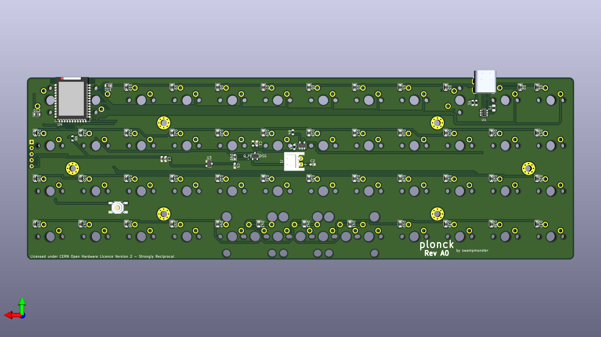

# plonck

An attempt at making a planck-compatible pcb with bluetooth  

## Current status:
### Rev A0 (NOT RECOMMENDED FOR PRODUCTION, READ STATUS)
I've received and built this version and it works fine but i made the mistake of wiring up the GND and VBUS pins on the ESD chip incorrectly.  
Thankfully those are the middle pins and simply desoldering and turning the chip around solves the problem.  
Update: Finally had time to test the load sharing circuitry and i had the pinout of the mosfet setup incorrectly which requires bodge wires to fix.  
If you are looking to get boards made from this revision you need to be aware of this but my recommendation would be to wait for the next one.

## License
The project is licensed under [CERN-OHL-S](LICENSE) (see [LICENSE](LICENSE) file) with the exceptions of:
- The [MX_Alps_Hybrid](MX_Alps_Hybrid) directory which is licensed under the [MIT License](https://opensource.org/licenses/MIT) and is made by [ai03](https://github.com/ai03-2725/MX_Alps_Hybrid).
- The [USB4085-GF-A_REVA](USB4085-GF-A_REVA) directory which is licensed under the [Creative Commons Attribution-ShareAlike 4.0 International License](https://creativecommons.org/licenses/by-sa/4.0/) and comes from [SnapEDA](https://www.snapeda.com/parts/USB4085-GF-A/Global%20Connector%20Technology/view-part/?ref=global%20connector%20technology_in&t=usb4085).
- The [PTS525SM15SMTR2LFS](PTS525SM15SMTR2LFS) directory which is licensed under the [Creative Commons Attribution-ShareAlike 4.0 International License](https://creativecommons.org/licenses/by-sa/4.0/) and comes from [SnapEDA](https://www.snapeda.com/parts/PTS525SM15SMTR2%20LFS/C&K/view-part/?ref=search&t=PTS525).
- The [SM02B-SRSS-TB_LF__SN_](SM02B-SRSS-TB_LF__SN_) directory which is licensed under the [Creative Commons Attribution-ShareAlike 4.0 International License](https://creativecommons.org/licenses/by-sa/4.0/) and comes from [SnapEDA](https://www.snapeda.com/parts/SM02B-SRSS-TB%28LF%29%28SN%29/JST%20Sales/view-part/447499).
- The [ul_SI2301CDST1GE3](ul_SI2301CDST1GE3) directory which is licensed under the terms provided in the Terms and Conditions on [Ultra Librarian](https://www.ultralibrarian.com/)

## Thanks
Huge shoutout to [4pplet](https://github.com/4pplet) for tons of advice and help.
