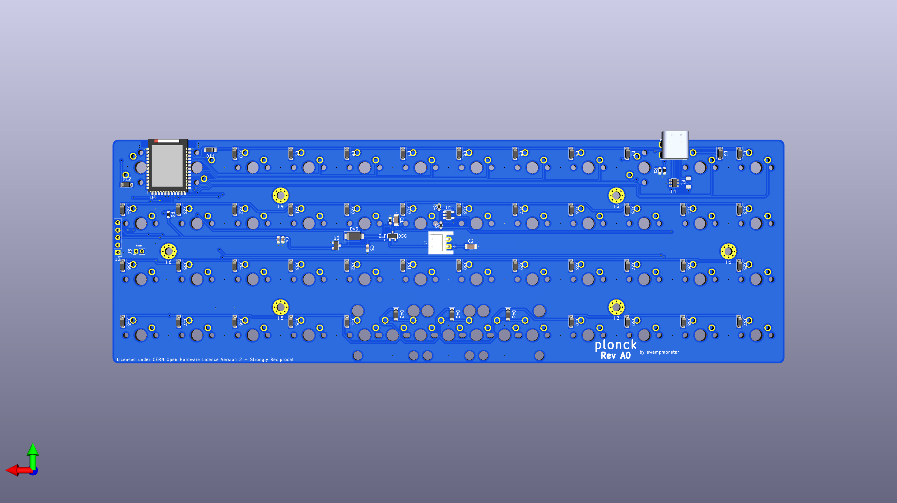

# plonck

An attempt at making a planck-compatible pcb with bluetooth

## Current status:
This is very much a work in progress, no pcb's have yet to be manufactured.  
The pcb may or may not even fit in standard planck cases so having one made is discouraged until  
i've actually had some made for myself.

## License
The project is licensed under [CERN-OHL-S](LICENSE) (see [LICENSE](LICENSE) file) with the exceptions of:
- The [MX_Alps_Hybrid](MX_Alps_Hybrid) directory which is licensed under the [MIT License](https://opensource.org/licenses/MIT) and is made by [ai03](https://github.com/ai03-2725/MX_Alps_Hybrid).
- The [USB4085-GF-A_REVA](USB4085-GF-A_REVA) directory which is licensed under the [Creative Commons Attribution-ShareAlike 4.0 International License](https://creativecommons.org/licenses/by-sa/4.0/) and comes from [SnapEDA](https://www.snapeda.com/parts/USB4085-GF-A/Global%20Connector%20Technology/view-part/?ref=global%20connector%20technology_in&t=usb4085).
- The [PTS525SM15SMTR2LFS](PTS525SM15SMTR2LFS) directory which is licensed under the [Creative Commons Attribution-ShareAlike 4.0 International License](https://creativecommons.org/licenses/by-sa/4.0/) and comes from [SnapEDA](https://www.snapeda.com/parts/PTS525SM15SMTR2%20LFS/C&K/view-part/?ref=search&t=PTS525).
- The [ul_SI2301CDST1GE3](ul_SI2301CDST1GE3) directory which is licensed under the terms provided in the Terms and Conditions on [Ultra Librarian](https://www.ultralibrarian.com/)

## Thanks
Huge shoutout to 4pplet for tons of advice and help.
